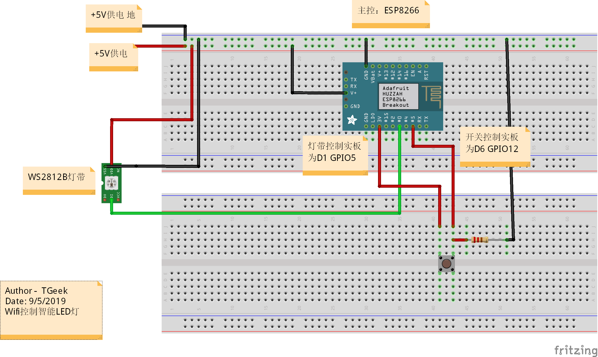

# Lamp
---

**LED智能灯**

**Author** : **TGeek**

**Date** : 11/5/2019

**Description** : 临近分别，亲手做一个送女朋友留纪念的小礼物

---

## 硬件

WS2812b LED灯带

ESP8266 WiFi模块

面包板 or PCB

导线、杜邦线

数据线，5V供电充电头

### 接线图



## 依赖

* ESP8266 2.5.0

  **以下均使用Arduino IDE liberty manager安装**

* FastLed 3.2.6

* ArduinoJson 5.13.5

## ESP8266库安装

1. Arduino IDE 1.8.7以上版本
2. *File* -> *Preferences* 在 *Additional Board Manager URLs* 填入 ```https://arduino.esp8266.com/stable/package_esp8266com_index.json```
3. *Tools* - >  *Board* 目录打开 *Boards Manager*
4. 输入ESP8266查找并安装指定版本

## 使用教程

#### 1.安装Blynk

安卓PLAY商店，苹果Appstore搜索blynk，（国内安卓用户翻墙PLAY商店下载 或者 自行百度寻找资源）并注册账号，注册时，记得将服务器地址该为自定义：smartled.cc （感谢知乎@英语老师摸我腿 Blynk服务器）

#### 2. 配置Blynk

登陆你的blynk,然后用Blynk扫描二维码，就可以添加好相关项目


点击右上角设置


点击device内容


点击my device内容


点击refresh刷新识别码，然后点击新识别码完成复制


#### 3.配置ESP8266 Wifi

将你的ESP8266通电，然后用你的手机搜索WIFI名字为【SmartLed】


并连接上去，他会提示你登陆，进入登陆页面后，点击【设置(扫描)】然后设置好你的WIFI，粘贴刚才你复制的Blynk 认证码，并保存。


#### 4. 控制

以上操作完成后，打开你手机的Blynk，选择你刚才创建的项目，并点击连接，这时候你应该可以看到你的ESP8266在线了，然后你就可以将你的灯接好来控制了。

#### 按钮控制

按钮优先级高于Wifi控制，点按切换模式，关闭->明亮模式->护眼模式->彩虹模式->关闭

#### 注意

Esp8266会保存wifi信息，配置完成之后相同wifi环境下不需要重新配置

当Esp8266连接不上你家里的WIFI的时候，他会回到AP模式 ，需要重新设置WIFI。所以不用担心设置好WIFI后，换到其他人家的WIFI没办法用。